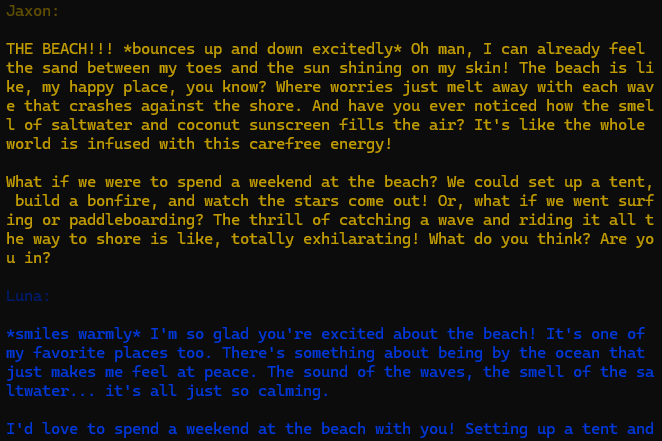

# LLM Duologue

Real-time conversation simulator between two AI participants. You define the
participants and the topic.



## Installation

**Note:** You must have [Ollama](https://ollama.com) installed and at least one
model pulled.

Clone the repository:

```bash
git clone https://github.com/travishorn/llm-duologue
```

Install the dependencies:

```bash
npm install
```

### Usage

You can stream a conversation in your own application like so:

```javascript
import { converse } from "../llm-duologue/src/index.js";

const alice = { model: "llama3.2", name: "Alice" };
const bob = { model: "llama3.2", name: "Bob" };

converse(alice, bob, "cute puppies").pipe(/* pipe the output somewhere */);
```

## Demo

Edit the conversation participants and/or the topic of conversation in
`./src/demo.js`. Make sure the models you choose are available through Ollama on
your machine.

Then, start the conversation:

```bash
npm start
```

The participants will have a continuous conversation, output to the terminal,
until 100 messages have been reached.

## Contributing

Contributions are welcome! Before submitting a pull request, please...

1. Lint with `npm run lint`
2. Format with `npm run format`

## License

The MIT License

Copyright 2024 Travis Horn

Permission is hereby granted, free of charge, to any person obtaining a copy of
this software and associated documentation files (the “Software”), to deal in
the Software without restriction, including without limitation the rights to
use, copy, modify, merge, publish, distribute, sublicense, and/or sell copies of
the Software, and to permit persons to whom the Software is furnished to do so,
subject to the following conditions:

The above copyright notice and this permission notice shall be included in all
copies or substantial portions of the Software.

THE SOFTWARE IS PROVIDED “AS IS”, WITHOUT WARRANTY OF ANY KIND, EXPRESS OR
IMPLIED, INCLUDING BUT NOT LIMITED TO THE WARRANTIES OF MERCHANTABILITY, FITNESS
FOR A PARTICULAR PURPOSE AND NONINFRINGEMENT. IN NO EVENT SHALL THE AUTHORS OR
COPYRIGHT HOLDERS BE LIABLE FOR ANY CLAIM, DAMAGES OR OTHER LIABILITY, WHETHER
IN AN ACTION OF CONTRACT, TORT OR OTHERWISE, ARISING FROM, OUT OF OR IN
CONNECTION WITH THE SOFTWARE OR THE USE OR OTHER DEALINGS IN THE SOFTWARE.
